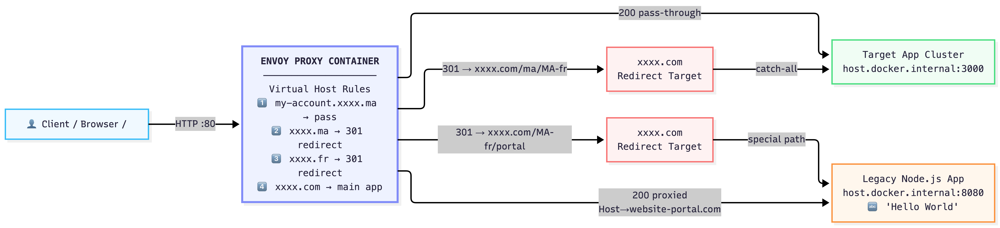

# Domain Routing — How It Works

This document explains, in plain terms, how traffic is routed between our domains.



## What this solves

We have several web addresses (`xxxx.ma`, `xxxx.fr`, `xxxx.com`, and a few special pages). Depending on which address a visitor types, we want them to land in the right place — sometimes on our main site, sometimes on a dedicated page, and sometimes on a page that actually comes from a separate legacy system, without them ever noticing.

A small traffic router sits in front of everything and decides where each visit should go, before it reaches any of our applications.

## What happens for each address

| A visitor goes to... | What they see |
| :--- | :--- |
| `my-account.xxxx.ma` | Opens normally, no redirection. This is a special account area kept as-is. |
| `xxxx.ma` | Sent automatically to `xxxx.com/ma/MA-fr`, our Moroccan homepage. |
| `xxxx.ma/portal` | Sent automatically to `xxxx.com/MA-fr/portal`, Portal page - Not managed in our System (legacy system). |
| `xxxx.fr` | Sent automatically to `xxxx.com/fr/fr`, our French homepage. |
| `xxxx.com` | Opens our main site directly. |
| `xxxx.com/MA-fr/portal` | Opens the portal page. The address in the browser stays the same, but the content is actually served by a separate legacy system behind the scenes — the visitor never sees or needs to know this. |

## Why we built it this way

- **One front door.** Every visitor, no matter which address they typed, ends up on `xxxx.com` — this keeps our brand, links, and tracking consistent.
- **Local addresses still work.** People typing `xxxx.ma` or `xxxx.fr` are gently redirected to the right language version, so nothing breaks for existing links or bookmarks.
- **The portal looks native, even though it isn't.** The portal page is technically hosted on an older, separate system, but visitors only ever see `xxxx.com/MA-fr/portal` in their browser. This lets us keep using the legacy system without it looking disconnected from the rest of our site.
- **Exceptions come first.** Special cases (like the account area or the portal) are always checked before the general rules, so they're never accidentally caught by a broader redirect.

---

## Technical Appendix

The routing above is implemented in [envoy.yaml](envoy.yaml), running as the `envoy` service in [docker-compose.yaml](docker-compose.yaml).

### Route evaluation order

Envoy matches virtual hosts by domain, then evaluates routes top-to-bottom within that virtual host — first prefix match wins.

| Block | Match | Action | Purpose |
| :--- | :--- | :--- | :--- |
| `my_account_exception` | `my-account.xxxx.ma` | `route: target_app_cluster` | Pass-through, no redirect. |
| `ma_redirect_domain` / `/portal` | `xxxx.ma/portal` (prefix) | `redirect: xxxx.com/MA-fr/portal` | Checked before the catch-all below so portal traffic isn't swept into the generic geo-redirect. |
| `ma_redirect_domain` / `/` | `xxxx.ma` (catch-all) | `redirect: xxxx.com/ma/MA-fr` | Generic geo-redirect for everything else on `xxxx.ma`. |
| `fr_redirect_domain` | `xxxx.fr` | `redirect: xxxx.com/fr/fr` | Geo-redirect for the French domain. |
| `main_app_domain` / `/MA-fr/portal` | `xxxx.com/MA-fr/portal` (prefix) | `route: wesite_portal_cluster` + `host_rewrite_literal` | Transparent proxy to the legacy backend; browser URL doesn't change. |
| `main_app_domain` / `/` | `xxxx.com` (catch-all) | `route: target_app_cluster` | Main application. |

### Key directives

- **`host_redirect` / `path_redirect`**: issues a 301 telling the browser to request a different host/path. The original request never reaches an app cluster.
- **`MOVED_PERMANENTLY` (301)**: aggressively cached by browsers — after changing a redirect target, test with `curl` or a private window, not a normal browser tab with prior history.
- **`host_rewrite_literal: "wesite-portal.com"`**: on the `/MA-fr/portal` route, rewrites the outgoing `Host` header so the legacy backend sees `wesite-portal.com` even though Envoy physically connects to `host.docker.internal:8080`. This mocks hitting the real legacy domain without needing actual DNS for it.
- **`host.docker.internal`**: lets the Envoy container reach services published on the host machine's ports (here, `3000` for the main app mock, `8080` for the legacy portal mock).
- **Envoy does not hot-reload `envoy.yaml`**: after editing the file, run `docker compose restart envoy` for changes to take effect.

### Legacy backend mock (`wesite-portal.com`)

`node-app/` is a minimal Node.js server returning `Hello World` on port `8080`, run as the `wesite-portal` service in `docker-compose.yaml`, published on host port `8080`.

Add to your local `/etc/hosts` (no port suffix — hosts files only map hostname to IP):

```
127.0.0.1 wesite-portal.com
```

This lets you hit the legacy backend directly at `http://wesite-portal.com:8080` for comparison, while Envoy reaches it internally via `host.docker.internal:8080`.

### Local testing

With the stack up (`docker compose up -d --build`) and `xxxx.ma`, `xxxx.fr`, `xxxx.com`, `my-account.xxxx.ma` mapped to `127.0.0.1` in `/etc/hosts`:

```bash
curl -I http://my-account.xxxx.ma        # 200, pass-through
curl -I http://xxxx.fr                   # 301 -> xxxx.com/fr/fr
curl -I http://xxxx.ma                   # 301 -> xxxx.com/ma/MA-fr
curl -I http://xxxx.ma/portal            # 301 -> xxxx.com/MA-fr/portal
curl http://xxxx.com/MA-fr/portal        # 200, "Hello World" (proxied from wesite-portal.com)
```
